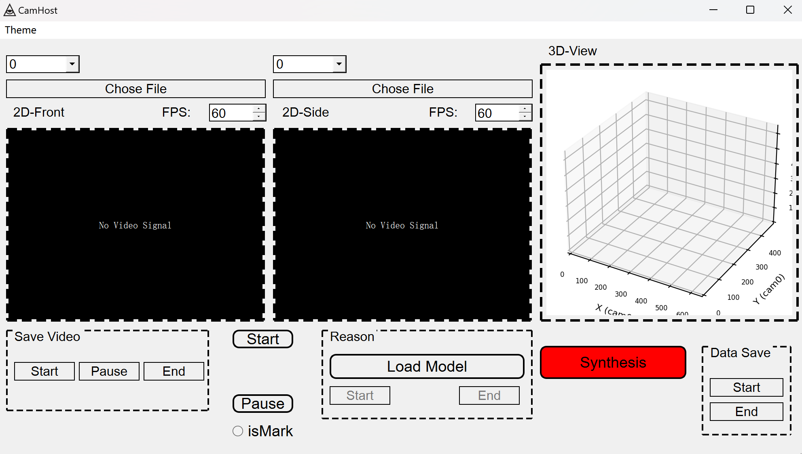
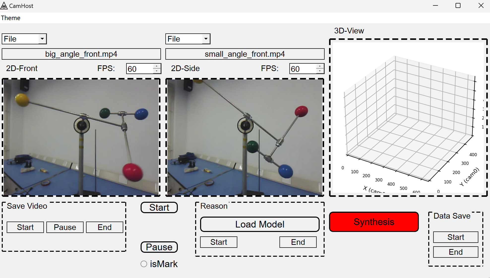
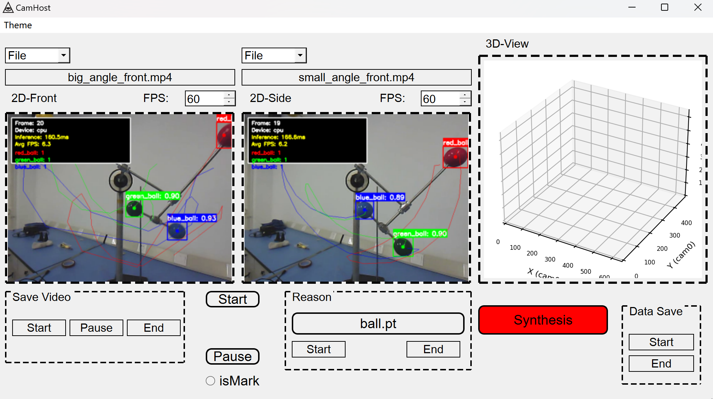
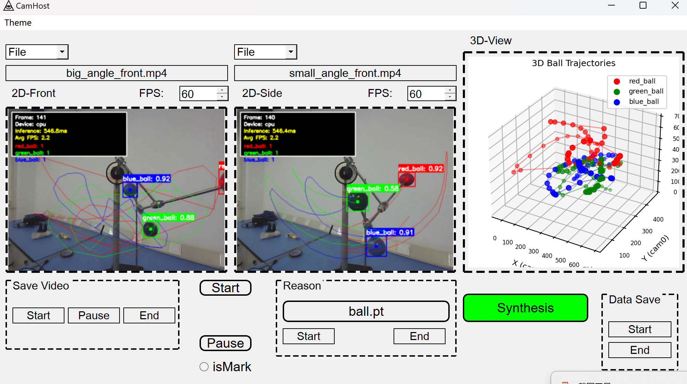

## 2D Synthesis 3D GUI
### 这是一个用pyqt5编写的GUI上位机程序, 用于 https://github.com/ShijianWen3/ball_track 项目的数据采集和演示
---
#### 🚀目前已完成基本功能:

- 视频播放
- yolo同步推理
- 二维数据合成三维数据并在canva显示

#### ☕正在开发的功能:

 - [x] 将两个窗口的推理由定时器触发改为线程实现
 - [ ] 视频的保存
 - [ ] 二维数据和三维数据的保存
 - [ ] 吸引子图像的绘制(反正已经加入了matplotlib库)

#### 主界面:

#### 测试视频效果:

#### yolo同步推理效果:

#### 2D-3D合成显示效果:

